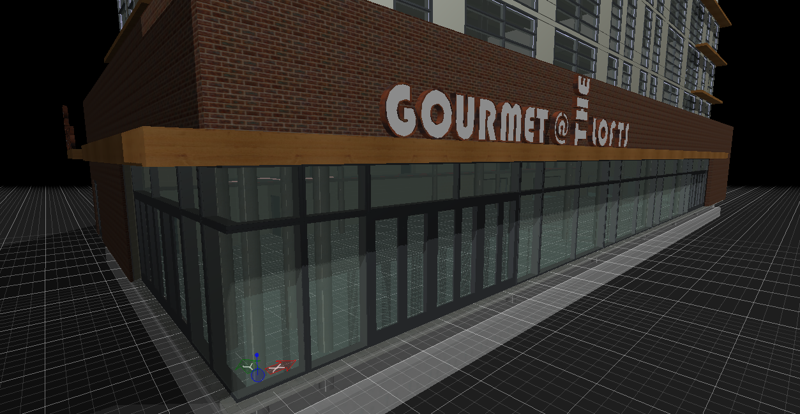
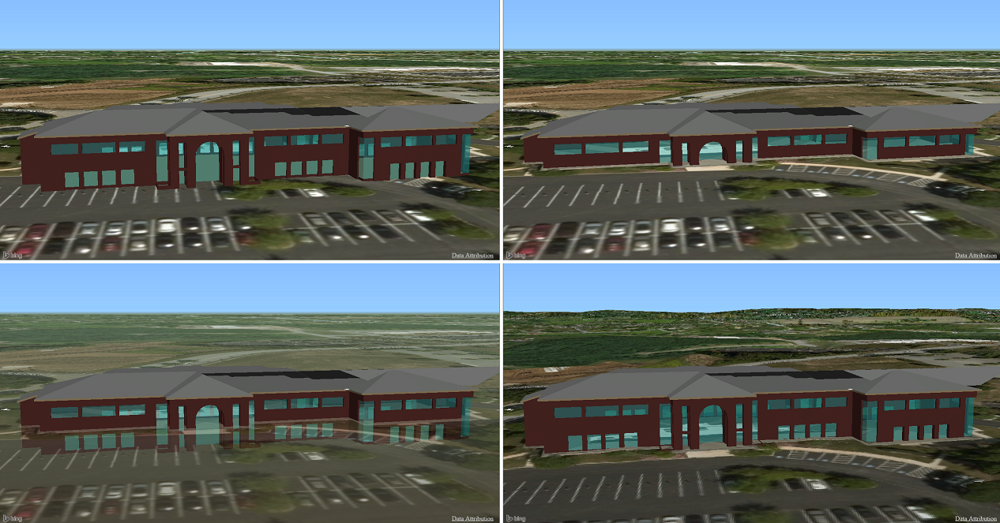
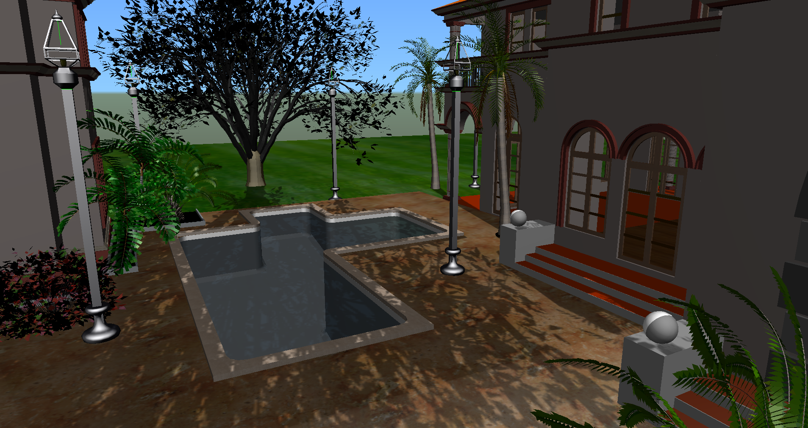

# 1.3.0 Change Notes

## Display system enhancements

### Improved drawing grid appearance and performance

### Map depth, transparency, and elevation

The background map is typically drawn behind all other geometry. This can be disorienting when viewing geometry that should be located below the ground. Now, the map can be rendered with depth, so that underground geometry is not visible when looking down at the map; or with transparency, so that underground geometry is only partially visible beneath the map. Additionally, the map can be draped onto real-world terrain meshes obtained from the [Cesium World Terrain](https://cesium.com/content/) service. All of these settings can be controlled by modifying the [BackgroundMapSettings]($common) associated with a [DisplayStyleState]($frontend).

* Top-left: Ordinary background map
* Top-right: Background map with depth
* Bottom-left: Background map with transparency
* Bottom-right: Background map with terrain

### Improved depth buffer resolution

When drawing geometry spanning large distances, visual artifacts like [z-fighting](https://en.wikipedia.org/wiki/Z-fighting) can occur as a result of the limited number of bits in the graphics driver's [depth buffer](https://en.wikipedia.org/wiki/Z-buffering). Typically these artifacts are addressed by reducing the maximum viewable distance, but this is not ideal. Instead, when the viewing distance is sufficiently large and the required [WebGL extension](https://www.khronos.org/registry/webgl/extensions/EXT_frag_depth/) is available on the client, a [logarithmic depth buffer](http://tulrich.com/geekstuff/log_depth_buffer.txt) is used to optimize the resolution of the depth buffer resulting in a larger viewable distance with fewer artifacts.

### Material atlases

The [RenderMaterial]($common) applied to a surface defines how the surface interacts with lighting, its diffuse color and transparency, and so on. This information must be sent to the graphics driver when drawing the surface. Previously, when generating tiles, surfaces with differing materials would not be batched together into larger meshes, resulting in a larger number of draw calls and therefore reduced performance. Now, surfaces using up to 255 different, un-textured materials can be batched into a single mesh. The impact on frames-per-second can be quite significant, particularly for models originating in applications like Revit which use materials extensively. An order-of-magnitude reduction in the number of draw calls, and consequent doubling of frames-per-second, was observed in one such model.

## Pan and Rotate viewing operations support inertia

The viewing tools Pan and Rotate now optionally support inertia. If the tools are used with a *flicking* action, they continue briefly with a decaying inertial effect. The behavior of the inertia is controlled by [ToolSettings.viewingInertia]($frontend).

## Shadow maps

Shadows can now be displayed in 3d views. The implementation uses exponential variance shadow maps to minimize the visual artifacts associated with traditional shadow maps to the extent possible under the limitations imposed by WebGL 1. To enable shadows for a view, set [ViewFlags.shadows]($common) to `true`. To change the time of day (and therefore the sun direction from which shadows are cast), use [DisplayStyle3dState.setSunTime]($frontend).

> Note: This feature is currently feature-gated; to enable it, set [RenderSystem.Options.displaySolarShadows]($frontend) to `true` when initializing your [IModelApp]($frontend).

> Note: This feature requires 2 WebGL extensions: EXT_texture_filter_anisotropic and either of OES_texture_float_linear of OES_texture_half_float_linear. On systems that do not support these extensions, shadows will not be displayed.

## Geometry

* Summary:
  * Triangulate cut faces in polyface clip.
  * Variant point data parse.
  * Bilinear Patch ray intersection
  * polyline small feature filtering
  * compute WireMoment on curves
  * compute volume moments on meshes.

* When clipping a polyface with a plane, new method optionally outputs triangulation of the cut plane face.
  * (static) `clipPolyfaceClipPlaneWithClosureFace(polyface: Polyface, clipper: ClipPlane, insideClip?: boolean, buildClosureFace?: boolean): Polyface;`
* Methods that support points loosely structured as type MultiLineStringDataVariant
  * Many point variants are parsed:
    * point as Point3d
    * point as [1,2,3]
    * point as {x:1, y:2, z:3}
    * Array [] of any of the above
    * GrowableXYZArray with points packed (x,y,z,  x,y,z,  x,y,z, ...)
  * Methods to convert the variant structures to specific preferred types:
    * (static) `GrowableXYZArray.createArrayOfGrowableXYZArrayFromVariantData (data: MultiLineStringDataVariant): GrowableXYZArray[];`
      * Return array of GrowableXYZArray.
    * (static) `LineString3d.createArrayOfLineString3dFromVariantData (data: MultiLineStringDataVariant): LineString3d[];`
    * (static) `Range3d.createFromVariantData(data: MultiLineStringDataVariant):Range3d`
    * (static) `Point3dArray.convertVariantDataToDeepXYZNumberArrays(data: MultiLineStringDataVariant): any[];`
    * (static) `Point3dArray.convertVariantDataToDeepXYZNumberArrays(data: MultiLineStringDataVariant): any[];`
* (static) `FrameBuilder.createFrameWithCCWPolygon (points: Point3d[])`
  * Create a transform in the plane of points.
  * flip Z directed so the polygon has CCW orientation.
* (static) `orientLoopsCCWForOutwardNormalInPlace(loops: GrowableXYZArray | GrowableXYZArray[], outwardNormal: Vector3d): number`
  * reverse order of loops (individually, no hole analysis) so all are CCW orientation for given outward normal.
  * Return number reversed.
* `Arc3d` methods
  * (static) `Arc3d.cloneAtZ(z?: number): Arc3d`
  Return projection to plane at `z`
  * (static) `Arc3d.createXYZXYZXYZ(cx: number, cy: number, cz: number, ux: number, uy: number, uz: number, vx: number, vy: number, vz: number, sweep?:     * AngleSweep, result?: Arc3d): Arc3d;`
    * create an arc with center, vector to 0 degree point, and vector to 90 degree point.
  * (static) `Arc3d.fractionAndRadialFractionToPoint(arcFraction: number, radialFraction: number, result?: Point3d): Point3d;`
    * evaluate a point at fraction position "along" the arc and at multiple of the radius.
* `GrowableXYZArray` instance methods to access individual x,y,z by point index without creating Point3d object:
  * `myGrowableXYZArray.getXAtUncheckedPointIndex (pointIndex: number) : number;`
  * `myGrowableXYZArray.getYAtUncheckedPointIndex (pointIndex: number) : number;`
  * `myGrowableXYZArray.getZAtUncheckedPointIndex (pointIndex: number) : number;`
  * `myGrowableXYZArray.length`
  * `GrowableXYZArray.moveIndexToIndex (fromIndex, toIndex)`
* `ParityRegion` methods to facilitate adding or creating with (strongly typed) loop objects
  * For both `create` or `add`, data presented as possibly deep arrays of arrays of loops is flattened to the ParityRegion form of a single array of Loops.
  * `(static) createLoops(data?: Loop | Loop[] | Loop[][]): Loop | ParityRegion;`
    * Note that in the single-loop case this returns a Loop object rather than ParityRegion.
  * `myParityRegion.addLoops(data?: Loop | Loop[] | Loop[][]): void;`
* `BilinearPatch` methods
  * Method to compute points of intersection with a ray:
    * intersectRay(ray: Ray3d): CurveAndSurfaceLocationDetail[] | undefined;
* `LineString3d` methods
  * method to create capture a GrowableXYZArray as the packed points of a LineString3d:
    * (static) `createCapture(points: GrowableXYZArray): LineString3d;`
* `NumberArray` methods
  * In existing static method `NumberArray.maxAbsDiff`, allow both `number[]` and `Float64Array`, viz
    * (static) `NumberArray.maxAbsDiff(dataA: number[] | Float64Array, dataB: number[] | Float64Array): number;`
* `PolyfaceBuilder` methods
  * convert a single loop polygon to triangulated facets.
    * (static) `PolyfaceBuilder.polygonToTriangulatedPolyface(points: Point3d[], localToWorld?: Transform): IndexedPolyface | undefined;`
* `SweepContour` methods
  * (static) `SweepContour.createForPolygon(points: MultiLineStringDataVariant, defaultNormal?: Vector3d): SweepContour | undefined;`
* `Range3d` methods
  * Existing methods with input type `Point3d[]` allow `GrowableXYZArray` with packed x,y,z content
    * (static) `Range3d.createInverseTransformedArray<T extends Range3d>(transform: Transform, points: Point3d[] | GrowableXYZArray): T;`
    * (static) `Range3d.createTransformedArray<T extends Range3d>(transform: Transform, points: Point3d[] | GrowableXYZArray): T;`
* `XYZ` methods (become visible in both Point3d and Vector3d)
  * `myPoint.subtractInPlace (vector: XYAndZ);
* Numerics
  * Gaussian elimination step for inplace updated of subset of a row `rowB[i] += a * rowA[i]` for `i > pivotIndex`
  * Solve up to 4 roots of a pair of bilinear equations
    * (static) `solveBilinearPair(a0: number, b0: number, c0: number, d0: number, a1: number, b1: number, c1: number, d1: number): Point2d[] | undefined;`
* `PolylineOps` new methods
  * (static) `PolylineOps.compressByPerpendicularDistance(source: Point3d[], maxDistance: number, numPass?: number): Point3d[]`
  * (static) `PolylineOps,compressShortEdges(source: Point3d[], maxEdgeLength: number): Point3d[]]`
  * (static) `PolylineOps.compressSmallTriangles(source: Point3d[], maxTriangleArea: number): Point3d[]`
* `RegionOps` new methods
  * (static) `RegionOps.computeXYZWireMomentSums(root: AnyCurve): MomentData | undefined`
  * (static) `RegionOps.constructCurveXYOffset(curves: Path | Loop, offsetDistanceOrOptions: number | JointOptions): CurveCollection | undefined;`
    * Create a path or loop offset by distance (positive to left)
  * (static) `RegionOps.createLoopPathOrBagOfCurves(curves: CurvePrimitive[], wrap?: boolean): CurveCollection | undefined;`
    * Create a curve structure, choosing type `Loop`, `Path`, or `BagOfCurves` appropriate to how the inputs join.
* `PolyfaceQuery` new methods
  * (static) `momentData = computePrincipalVolumeMoments(source: Polyface): MomentData | undefined`
    * Returns momentData structure with centroid, volume, radii of gyration.
  * (static) `static boundaryEdges(source: Polyface, includeDanglers: boolean = true, includeMismatch: boolean = true, includeNull: boolean = true): CurveCollection | undefined`
    * Within a polyface, find edges that have unusual adjacency and hence qualify as "boundary" edges.

