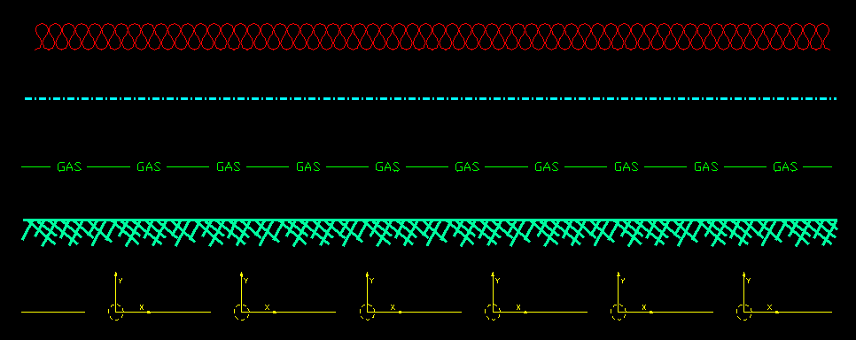
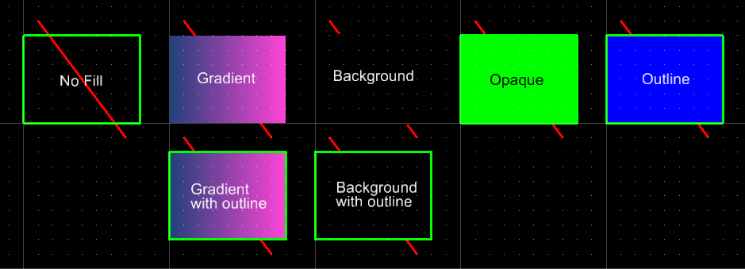
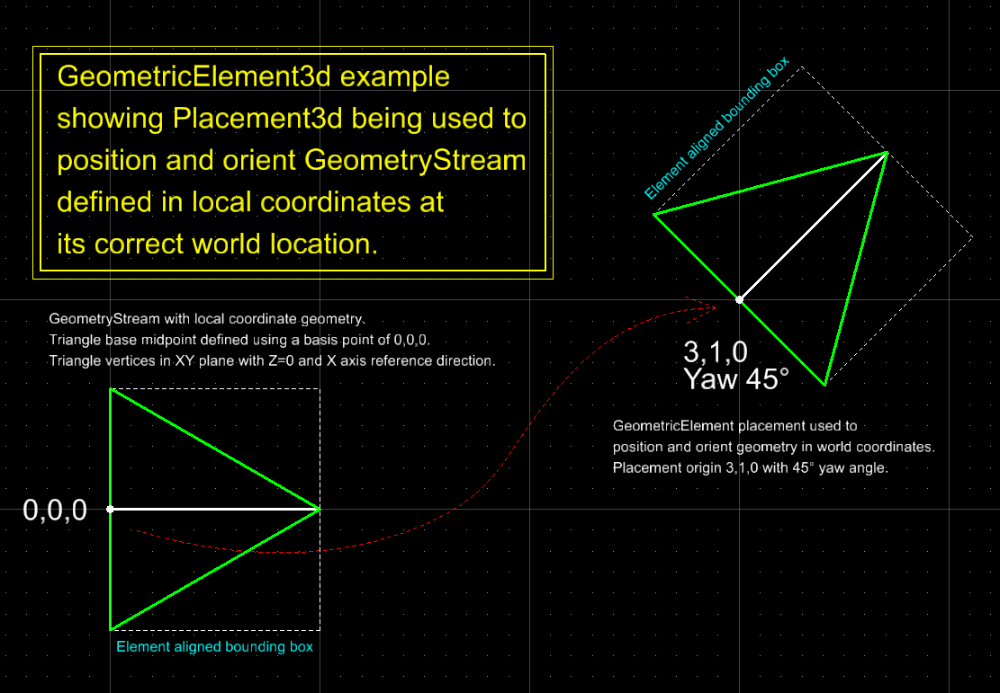
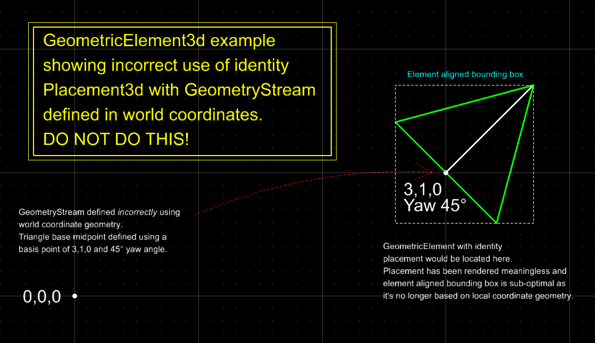
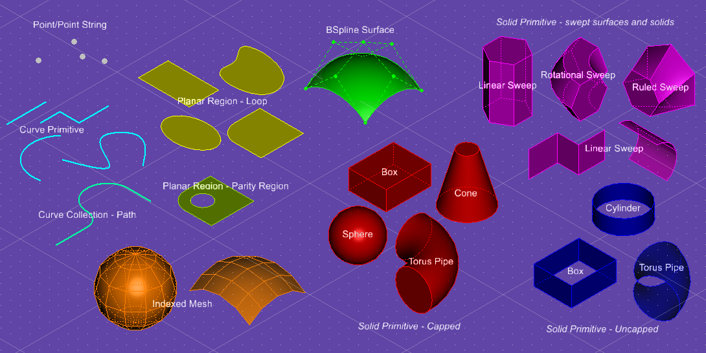
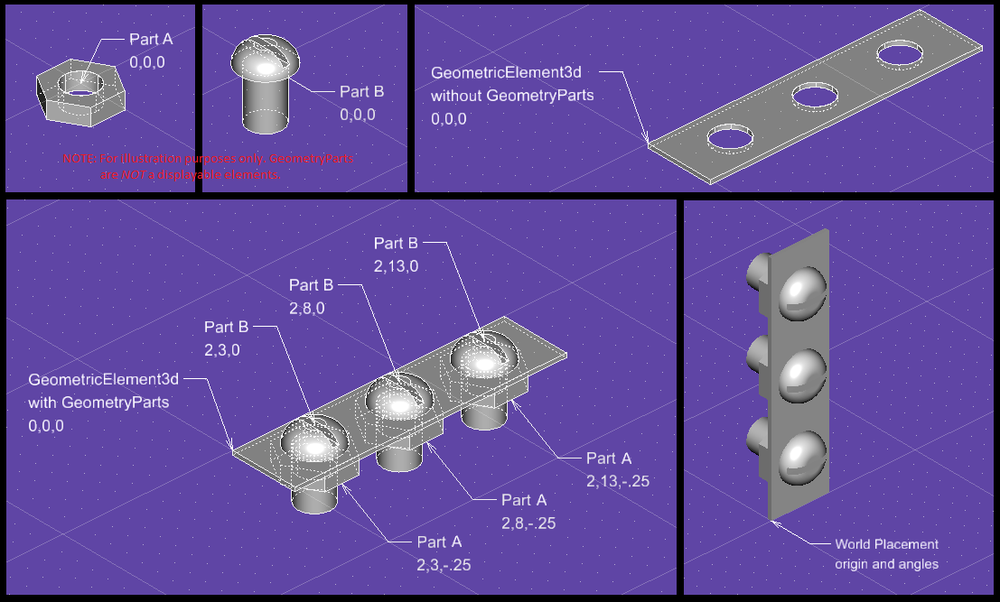

# GeometryStream

The [GeometryStreamProps]($common) wire format describes how the graphics and appearance information for [GeometricElement]($backend) and [GeometryPart]($backend) is serialized to JSON. A GeometryStreamProps is an array of [GeometryStreamEntryProps]($common) entries.

Appearance related entries are all completely optional. The recommended approach to establish graphical appearance is through [SubCategoryAppearance]($common). A GeometricElement's [Category]($backend) determines the default appearance for any graphics in its GeometryStream, which is the SubCategoryAppearance of the default [SubCategory]($backend), see [Category.myDefaultSubCategoryId]($backend). For a GeometryPart, it inherits the appearance established by the GeometricElement's GeometryStream through which it is instanced.

Some appearance entries override the default SubCategoryAppearance, while others are for supplying additional appearance information that is not generally applicable to all geometry types and isn't represented in SubCategoryAppearance. The following entries are specific to setting the appearance of graphics in the GeometryStream:

  * [GeometryAppearanceProps]($common)
    * The presence of a GeometryAppearanceProps entry in the GeometryStreamProps array always signifies clearing all SubCategoryAppearance overrides, even when all values are undefined.
    * Defined values, with the exception of GeometryAppearanceProps.geometryClass, override a corresponding SubCategoryAppearance value.
    * The SubCategoryAppearance used for geometry entries that follow in the GeometryStreamProps array is determined by [GeometryAppearanceProps.subCategory]($common). Default SubCategory for GeometricElement's Category is used when undefined.

  * [LineStyle.ModifierProps]($common)
    * Modifies the default appearance from the [LineStyle]($backend) definition element identified by [GeometryAppearanceProps.style]($common) or [SubCategoryAppearance.styleId]($common).
    
    * Add instance specific overrides (ex. defining up direction for style in 3d) for stroked line styles. Override stroke lengths, gap lengths, and stroke widths.
    * Stroked line styles are only applicable to [IModelJson.CurvePrimitiveProps]($geometry) and [IModelJson.CurveCollectionProps]($geometry) entries; it does not apply to edges of non-region surfaces or solids.

  * [AreaFillProps]($common)
    * Add a gradient, background, opaque, or outline fill to the display of [IModelJson.PlanarRegionProps]($geometry) entries. Opaque fill can also be added to a [IModelJson.IndexedMeshProps]($geometry) entry.
    
    * Fill is only applicable to views that have [ViewFlags.renderMode]($common) set to [RenderMode.Wireframe]($common).
    * To be considered filled, [AreaFillProps.display]($common) must be defined to something other than [FillDisplay.Never]($common).
    * If [AreaFillProps.display]($common) is defined as [FillDisplay.ByView]($common), the view's [ViewFlags.fill]($common) determines whether the geometry displays as filled.
    * Planar regions always display as surfaces in non-Wireframe views regardless of the value for [FillDisplay]($common); they will however use the fill color as opposed to the line color when fill is specified.

  * [AreaPattern.ParamsProps]($common)
    * Add a hatch, crosshatch, area pattern, or hatch definition to the display of [IModelJson.PlanarRegionProps]($geometry) entries.
    
    * A planar region can have both fill and pattern.
    * Pattern display is controlled by [ViewFlags.patterns]($common) for the view.

  * [MaterialProps]($common)
    * Override for [SubCategoryAppearance.materialId]($common). Can be used to add or remove material for the display of surface and solid geometry.
    
    * Material is only applicable to views that have [ViewFlags.renderMode]($common) set to [RenderMode.SmoothShade]($common).

Geometry entries should *always* be inserted into the GeometryStreamProps array unrotated with a basis point of 0,0,0 (local coordinate frame). The world location and orientation of the geometry is determined by the GeometricElement's placement origin and angle(s), [GeometricElement3dProps.placement]($common) and [GeometricElement2dProps.placement]($common).

> A GeometricElement can be translated and rotated by just updating its placement, the geometry is *not* transformed.

The element aligned bounding box that is part of the placement is computed automatically based on the local coordinate geometry. An application should leave [Placement3dProps.bbox]($common) and [Placement2dProps.bbox]($common) undefined when inserting a new GeometricElement or updating an existing element's GeometryStream; any defined value will be ignored.

  * [IModelJson.GeometryProps]($geometry)
    * Geometric primitive types: points, curves, paths, planar regions, bspline surfaces, surface primitives, solid primitives, linear sweeps of paths and regions, rotational sweeps of paths and regions, ruled sweeps of paths and regions, and index meshes.
    
  * [GeometryPartInstanceProps]($common)
    * Add a reference to a [GeometryPart]($backend) from the GeometryStream of a [GeometricElement]($backend). Used to instance repeated geometry; the part geometry is defined once and then shared by multiple GeometricElements or referenced multiple times by a single GeometricElement.
    * The [GeometryPartInstanceProps.origin]($common) and [GeometryPartInstanceProps.rotation]($common) specify the relative location from the basis point (typically 0,0,0) used for the GeometricElement's geometry.
    
    * Not valid when creating a [GeometryPart]($backend), nesting of GeometryParts is not supported.
    * As the GeometryPart does not specify a Category, and its GeometryStream does not support SubCategory changes; Category and SubCategory is established by the GeometricElement prior to adding a GeometryPartInstanceProps to the GeometryStreamProps array.
  * [TextStringProps]($common)
    * Add a single line of text to the GeometryStream for a GeometricElement or GeometryPart.
    * The [TextStringProps.origin]($common) and [TextStringProps.rotation]($common) specify the relative location from the basis point (typically 0,0,0) used for the GeometricElement's geometry.
  * [BRepEntity.DataProps]($common)
    * Raw BRep data, not generally useful outside of a geometry export scenario.
    * The BRep data must be specifically requested using [ElementLoadProps.wantBRepData]($common).
    * The body type, body to local transform, and any face material attachments are returned when requested using [ElementLoadProps.wantGeometry]($common).
  * [LowAndHighXYZ]($geometry)
    * Store range of each geometric primitive to allow efficient filtering on range criteria without having to instantiate the geometry.
    * Useful for GeometryStreams containing more than one geometric primitive; for a single geometric primitive, the geometry range is the placement's bounding box.
    * Not necessary for [GeometryPartInstanceProps]($common) entries, a [GeometryPart]($backend) stores its bounding box in [GeometryPart.bbox]($backend).
    * To include sub-ranges when creating a new GeometryStream, just add this entry to the GeometryStreamProps array before adding geometry. The low and high values will be computed automatically and will be ignored.

## Creating a GeometryStream

To help with the creation of the GeometryStream for a new GeometricElement or GeometryPart, [GeometryStreamBuilder]($common) is provided.

  * Appearance information can be specified by a [GeometryParams]($common) object that will append all relevant wire format entries to the GeometryStreamProps array.
  * Geometric primitives can be specified by a [GeometryQuery]($geometry) object that will append the appropriate wire format geometry entry.
  * Supports supplying entries in world coordinates, such as from an [InteractiveTool]($frontend), and transforms them to placement relative local coordinate entries.

## Iterating a GeometryStream

To help with inspecting the GeometryStream of an existing GeometricElement or GeometryPart, [GeometryStreamIterator]($common) is provided.

  * Appearance related wire format entries are accumulated in a single [GeometryParams]($common) object.
  * Iterator stops when it encounters a geometric entry: [GeometryQuery]($geometry), [TextString]($common), or a [GeometryPart]($backend) reference.
  * Current iterator provides the [GeometryParams]($common) that determines the appearance of the geometry entry as well as the [GeometryStreamIteratorEntry.localToWorld]($common) transform.
  * Supports returning entries in world coordinates when supplied the GeometricElement's placement.
  * Supports iterating the GeometryStream of a GeometryPart in the context of a GeometricElement's GeometryStream.
