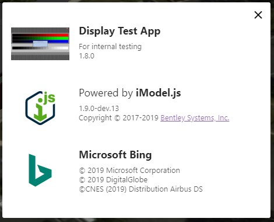

# Logo Cards

To provide credit notifications for software or data authors from within an iModel.js application, iModel.js displays its icon in the lower left corner of viewports.


When the user clicks or taps on the icon, a set of *Logo Cards* with notices and logos for the content of the view is displayed. Applications may also add their own Logo Card to display information about their authors, versions, status, etc.



## Creating an Application Logo Card

Applications can supply their own Logo Card by implementing [IModelApp.applicationLogoCard]($frontend).

E.g.:

```ts
[[include:Application_LogoCard]]
```

## Customizing Logo Card Appearance

Applications can customize the appearance of Logo Cards in .css files.

Logo Cards use the following css classes for the `HTMLElement`s it uses:

class | usage
---|---
`logo-cards` | Div to position the logo dialog in the center of the screen
`logo-card h2` | The style for the heading on each card
`logo-card-message p` | The style for the notice on each card
`logo-card-logo` | The style for the logo image on each card

## Customizing the iModel.js icon in Viewports

By default the iModel.js icon is displayed as an [HTMLImageElement](https://developer.mozilla.org/en-US/docs/Web/API/HTMLImageElement) in the lower left corner of all [ScreenViewport]($frontend)s. The logo uses the `imodeljs-icon` css selector class, so its appearance may be customized via application-supplied css.

If you wish to customize the logo in *just a single viewport*, it may be accessed by the member [ScreenViewport.logo]($frontend), and modified with inline styling. e.g.:

```ts
  vp.logo.style.width = "40px";
```

Sometimes it may be desirable to hide the logo in specialized viewports, particularly when multiple viewports are visible. That can be accomplished via:

```ts
  vp.logo.style.display = "none";
```

Please keep in mind:

* The icon may not be replaced with anything other than the iModel.js logo. Place your logo on a Logo Card.
* The icon may be positioned anywhere in the view where it is least obtrusive, but the opacity should not be set below 40% and its size should not be smaller than 24 pixels.
* The icon **may not** be removed entirely in views that may show maps, terrain, point clouds, or other copyrighted material, since it is required to show the copyright attribution of data suppliers.
