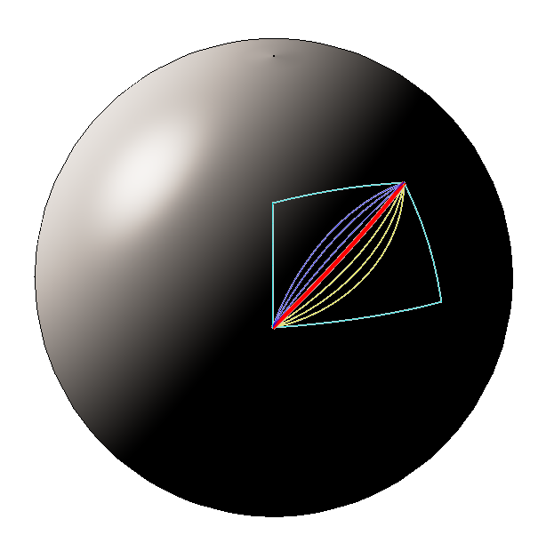
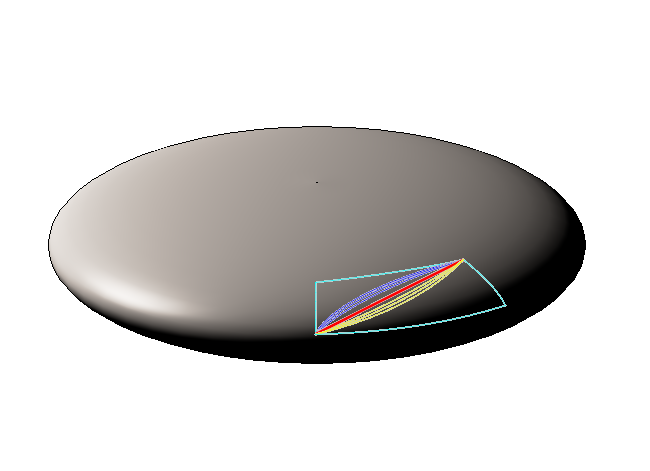
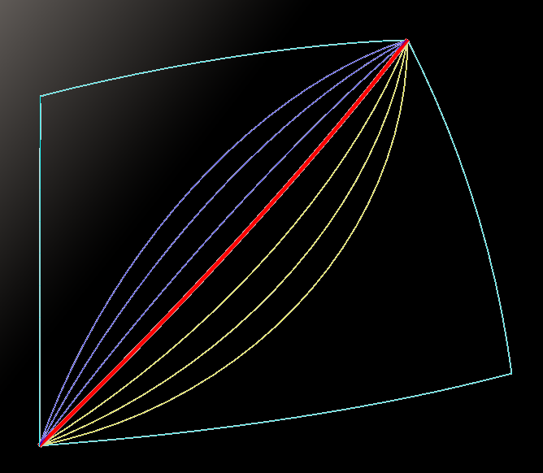
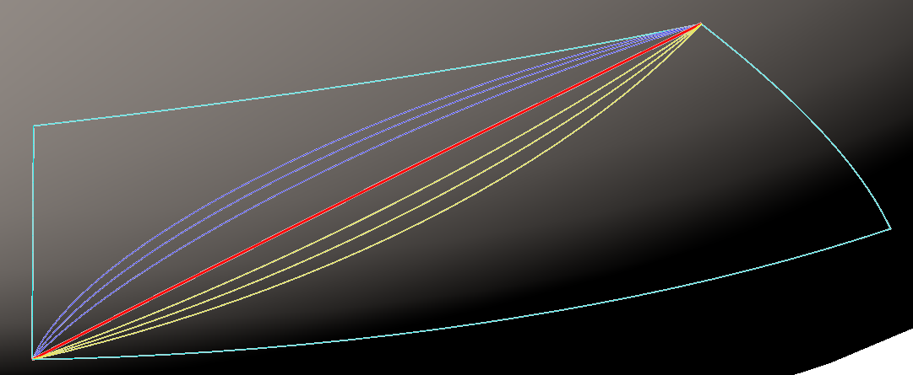
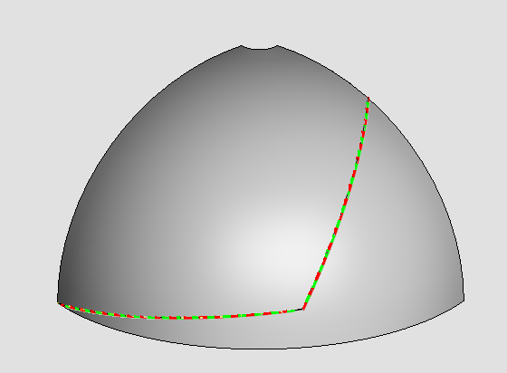
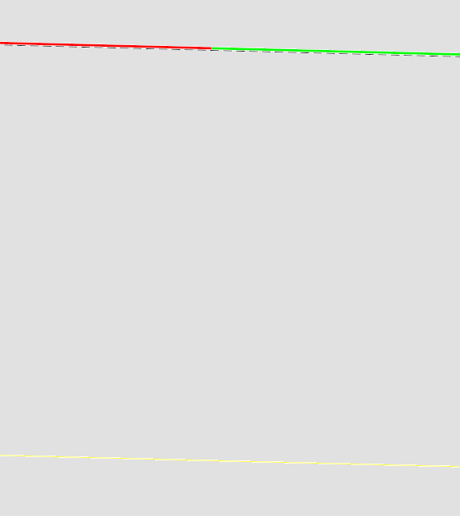

# Paths on Spheres and Ellipsoids

|  | Perfect Sphere | Ellipsoid |
|---|---|---|
| Surface with paths |  |  |
| Closeup |  |  |
| The _red_ Arc is intersection of the sphere with   a plane passing through the two endpoints and through the sphere or ellipsoid center.| On the _sphere_   * this is a "great circle"   * its radius equals the sphere radius   the red arc is the shortest path between its on-sphere points. | On the _ellipsoid_   * the intersection is elliptic (not circular)   it is _not_ the _shortest_ path between its endpoints. |
| blue and yellow arcs are intersections of planes containing the two endpoints but _not_ the sphere or ellipse center. | Side arcs are   * always longer paths than the red arc   always _circular_ | Side arcs   can be shorter than the red arc   If the plane is not perpendicular to the principal axes of the ellipsoid, these are _ellipses_ rather than circles |
| | |

## True shortest paths on an ellipsoid

As described in https://en.wikipedia.org/wiki/Geodesic, true shortest paths on an _ellipsoid_ are more complex than on a sphere:
* The section cut by a plane through the center of the ellipsoid is an ellipse.
* Section cuts by slightly other planes (slightly tipped from that central section) can be shorter.
  *  Among these section cut arcs, an "almost optimal" shortest such arc can be determined by trial and error search.
* The true shortest path is _not_ a planar section cut.
  * The true shortest path is the solution of a differential equation (see the wiki link), and does not have an exact parametric curve form.
  * Smoothly spaced points along an approximate shortest path can be computed efficiently.

## API for plane sections

| signature | Description |
|---|---|
| myArc = ellipsoid.radiansPairToGreatArc  (longitudeRadiansA, latitudeRadiansA, longitudeRadiansB, latitudeRadiansB) | Construct an arc passing the ellipsoid center and both on-ellipsoid points. |
| myArc = ellipsoid.createPlaneSection (plane: Plane3dByOriginAndUnitNormal) | Create the section cut arc for the given plane. |
| myArc = ellipsoid.createSectionArcPointPointVectorInPlane(pointAnglesA: LongitudeLatitudeNumber, pointAnglesB: LongitudeLatitudeNumber, inPlaneVector: Vector3d) | Define a plain from (a) two on-surface points defined by their angles and (b) an additional vector that is _in the plane_ (not perpendicular) |
| myArc = ellipsoid.constantLatitudeArc (longitudeSweep, latitudeRadians) | create an arc at constant latitude, with given extent of arc given as longitudeSweep. |
| myArc = ellipsoid.constantLongitudeArc (longitudeRadians, latitudeSweep) | create an arc at constant longitude (meridian), with given latitudeSweep |

## API for points on shortest path.

This figure shows a two paths
* starting at the equator to the left
* moving 70 degrees eastward and 10 northward, and (c) move 50 degrees further east and 48 north

The ellipsoid has equator and pole radii of the earth: 6378136.6952 at the equator, 6356751.9952 to the poles.

At this level of resolution, it is difficult to discern that there are three nearly overlapping draw components on each portion of the path.
* A (single, yellow) "great arc" of intersection with the plane defined by start and end points and ellipsoid center.
  * This is computed by `ellipsoid.radiansPairToGreatArc`
* Alternating red and green arcs that span about 2 degrees each.  The endpoints are computed by an approximation algorithm that produces the joints at 2-degree separation.
  * The points on this path are computed by `GeodesicPathSolver.createGeodesicPath`
* Almost coincident with the alternating red and green, another, non-central plane intersection, this time with a plane defined by the two endpoints and a true surface normal somwhere along the way, chosen by sampling among about 40 candidates to get the smallest length.
  * candidate planes to create section arcs are computed by `ellipsoid.createSectionArcPointPointVectorInPlane` with 40 candidate "in plane" vectors computed based on endpoint surface normals

This figure is a deep zoom to a portion of the first path section:

The lines correspond to those noted just above:
* The yellow line is the "great arc" in the plane through the ellipse center
* The alternating red and green arcs are from the approximation.
* The black dashed arc is the arc arc-on-non-central plane.

The lengths of the three options are:

| path | part 1 (from left) | part 2 (larger rise)
|---|---|---|
| great arc  | 7827036.0763780745 | 6795925.786107286 |
| best approximation points | 7827035.800205464 | 6795924.620597046 |
| best approximation plane |7827035.812282476 | 6795924.645774302 |

Note that because the first path stays close to the circular equator the differences are small -- less than 30 cm.  The second path gets closer to the pole and has differences of 1.1 meters.

The transverse separation from the central great arc to the approximate minimal paths is close to a kilometer.   Transverse separation of dotted and red/green paths is around 5 meters.
